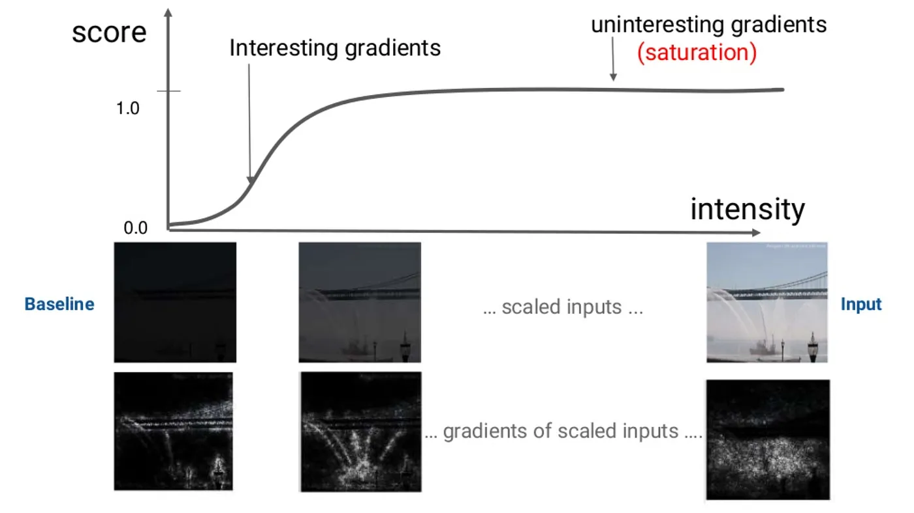
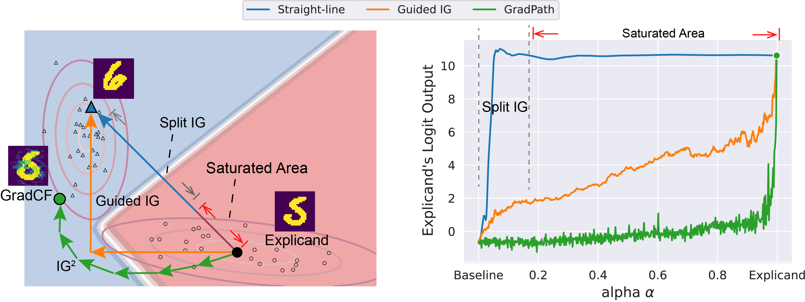
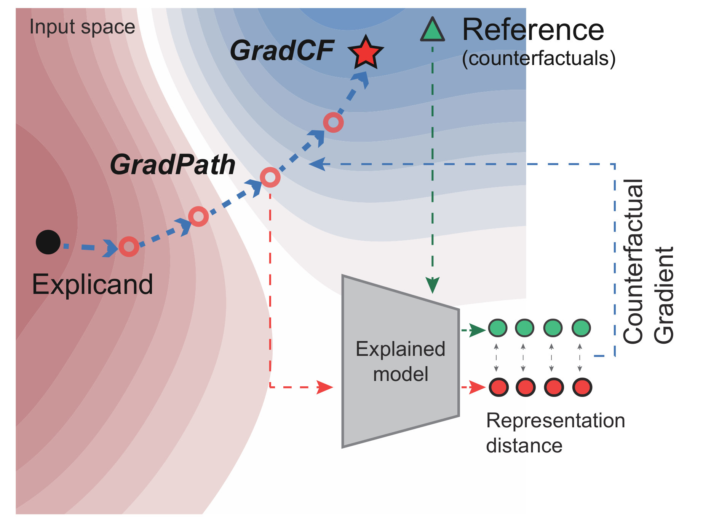
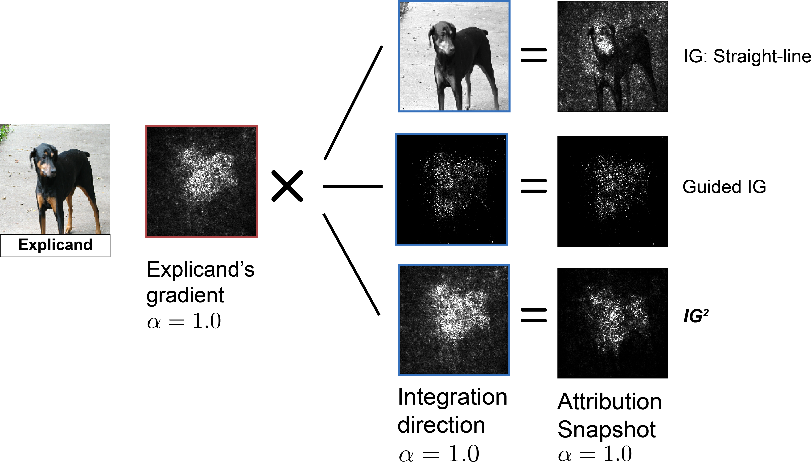
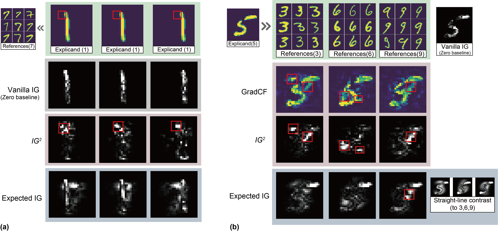
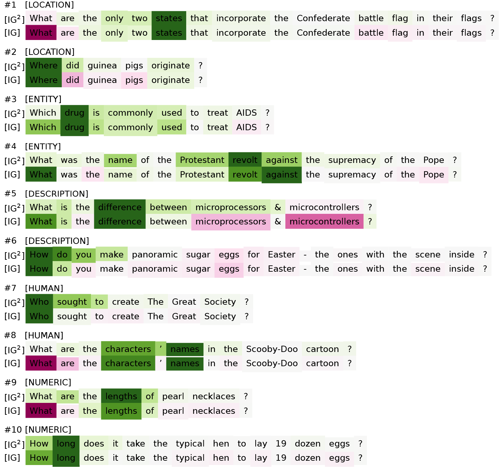
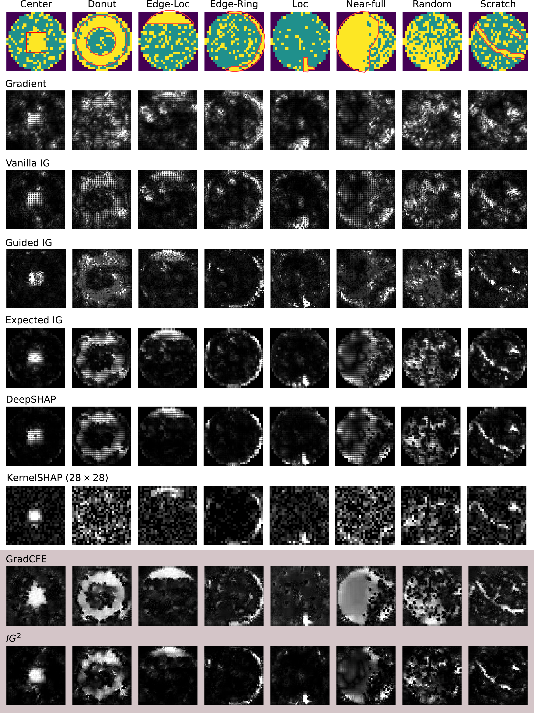

Integrated Gradients (IG) is a gradient-based approach for explaining deep models. IG methods integrate the gradient along a path for attributing the feature importance. With many desirable axioms, path (attribution) methods achieve great success over the simple gradient techniques. However, although many IG variants have been proposed, there still remains a lot of discussions about the two primary hyperparameters (e.g., path and baselines). In this post, I will introduce IG 2 (**I**terative **G**radient path **I**ntegrated **G**radients), a IG variant with novel path, named GradPath, and novel baseline, GradCF. IG 2 achieves superior performance over the SOTA feature attribution technique.

 Feature attributions on images from ImageNet dataset. The predicted classes are listed in square brackets.

## Understanding Integrated Gradients

Integrated Gradients (IG) is an Explainable AI technique introduced in the paper [\``Axiomatic Attribution for Deep Networks''](https://arxiv.org/abs/1703.01365). IG provides feature attribution for deep neural networks, quantifying the contributions of individual features, such as pixels, to the model output. These results can support the users in reasoning which input elements drive the model predictions.

Gradients is a naive feature attribution, which analogizes the model coefficients for a deep network. Early methods such as Saliency Map, Grad-CAM and Guided Backpropagation are representative based on local gradient. However, the local gradients in the input neighborhood are misleading, which is known as the gradient saturation effect.

Image by Krishnaram Kenthapadi (<a href='(https://www.slideshare.net/KrishnaramKenthapadi/explainable-ai-in-industry-kdd-2019-tutorial'>Explainable AI in Industry<\a>)(KDD 2019 Tutorial))

**Gradient saturation effect** is caused by the flat and smooth loss landscape of well-trained neural networks. The model prediction is very stable in the local neighborhood around the input instance. This results in the noisy gradients on irrelative features, whereas only the gradients leading to model prediction change are of interest.

IG is a path (attribution) method to address this effect by accumulating all the gradients along the path between the explained instance (i.e., **explicand**) and **baseline** (introduce below). Path methods rooted in Aumann-Shapley game theory, adhere to many describable axioms and IG has recently become a popular technique for explaining deep models.

**Baseline** is one of two primary hyperparameters of path methods (another is the integration path). Baseline introduces the concept of counterfactual explanation, which contrastively explain the models by answering:

> Which features cause the model output prediction A (of explicand) rather than counterfactual prediction B (of baseline)?

From the perspectives of philosophy and psychology, the counterfactuals align with human cognition to explain unexpected events, and have been widely applied in XAI techniques, such as Shapley-value based attribution methods like SHapley Additive exPlanations (SHAP) and DeepLIFT.

### IG variants

Almost all the variant path methods are dedicated into designing better integration path or baseline for improving feature attributions:

* **Paths:** Blur IG integrated the gradients on the gradually blurred image path. Guided IG adaptively chooses the path by selecting features with the smallest partial derivatives. [Split IG](https://arxiv.org/abs/2010.12697v1) restricted the integral to regions with interesting gradients where the model output changes substantially.
* **Baselines:** Sturmfels et al. discussed various baselines’ impacts on the path methods, and expected IG sampled the baselines from the data distribution. Blur IG applied a blurred explicand as the baseline.

Table below summarizes the existing IG-based methods from the aspects of path and baseline, comparing with our proposal IG2.

| Methods                          | Path                        | Baseline           |
| -------------------------------- | --------------------------- | ------------------ |
| IG                               | straight line               | zero vector        |
| Expected IG                      | straight line               | train data         |
| XRAI                             | straight line               | black+white images |
| Blur IG                          | blur path                   | blurred image      |
| Split IG                         | part of straight line      | zero vector        |
| Guided IG                        | projection of straight line | zero vector        |
|                                  |                             | maximal distance   |
| Sturmfels et al.                 | straight line               | noised data        |
|                                  |                             | uniform noise      |
| **IG2** | **GradPath**          | **GradCF**   |

Summary of existing path methods from the aspects of path and baseline. 

## IG2: Advancing on Previous Success

IG2 advances in feature attribution by novel path and baseline. They both show the positive effect on path attribution. From these two essential parts, I will introduce IG2 in the following, explaining how and why they work.

### GradPath: Mitigating Saturation Effects

As introduced before, IG is proposed for addressing the saturation effect in local gradient methods. However, though IG contains interesting gradients, the saturation area with noisy gradients are inevitably traversed. Some previous research with improved paths have been proposed for this issue. Let us see how they work.

Illustration of paths in Split IG, Guided IG and IG2, taking a Digit 5 instance in MNIST as explicand and Digit 6 instance as baseline.  

**Split IG** avoids the saturation effects by only integrating on the region that model prediction is rapidly decreasing.

**Guided IG** is more sophisticated. From explicand to baseline, it first integrated gradients on the directions with the largest gradient. However, each step of Guided IG only directs to partial components of straight vector. This restricts the path of Guided IG on the projection of straight line.

The previous research work has proven that integrating on the paths where model prediction drastically declines leads to better attribution results. However, these paths were still modified based on straight line between baseline and explicand. It is natural to think that:

> Why not build a path that makes the model prediction fall the fastest?

This is highly similar to the gradient-based adversarial attack (e.g, PGD attack). Given a sample $x$, PGD attack iteratively searches the adversarial example $x'$ by:

$$
x' = x+ \epsilon \cdot \nabla f(x)
$$

where each perturbation step is built on the gradient direction $\nabla f(x)$.

But only making the model prediction decrease fast is not enough. When we build integration path, we want to search a counterfactual example, used to explain the difference between explicand and the counter class sample. Thus, we built the GradPath on the gradient of representation difference between explicand and counter class reference, $x^r$:

$$
\nabla \|f'(x) - f'(x^r) \|^2_2
$$

where $f'$ is the bottleneck layer output of deep neural networks.

At the endpoint of path search, we obtain the baseline of IG2, GradPath.

> In IG2, we do not directly use the counter class samples as the baseline (which is applied in expected IG). Instead, the baseline (i.e, GradCF) is calculated based on the counter class samples by the equation above. We name this counter class sample as the reference.

The figure shows how GradPath is built at each step, which is on the counterfactual direction for minimizing the model representation distance to the reference. On one hand, the path completely avoids the saturated area. On the other hand, this path direction emphasizes the features that are most significant for distinguishing the exlicand and counter class reference.

**ImageNet Example:** Next, I will use a Doberman instance from ImageNet to show the effect of GradPath. The figure compares the attribution snapshots of three different paths at the point of explicand ($\alpha=1$). The path attribution snapshot at certain point is calculated by multiplication of explicand's gradient and integration direction. At $\alpha=1$, different paths share the same explicand's gradient and only differs in the integration direction.
Shown by Doberman example, the straight line path with saturated areas cause undesirable noise in the background. Guided IG and IG2 effectively mitigate this saturation effect. Compared to Guided IG, IG2 is more aligned with the image subject (Doberman), leading to the attribution that accurately highlights the image region of dog body, which is also more aligned with human intuition.

### GradCF: Contrasting at Semantic Level

The baselines used in earlier path methods, including white/black vectors, counter class samples and blurred explciand, naively contrasts with the explicand in input space, but don't contain any information from the explained model. However, in the context of model explanation, a good counterfactual example should highlight the feature difference that makes the model output different predictions. Hence, we argue that:

> A good baseline in path methods should show the model semantic information by contrasting with the explicand.

We obtain IG2, GradCF, by building the integration path. In the following, with a MNIST example, I will demonstrate the why GradCF is a better baseline for integrated gradients.

Feature attributions of MNIST samples. (a) Shifted digital 1s explained with the references of digitals 7. (b) Digitals 5 explained with the references of different categories (digitals 3, 6, 9). The most critical areas that distinguish the explicand to reference are marked by red boxes, e.g., the explained digitals 1 will become digital 7 if we filled these areas. IG2 is compared with vanilla IG (using black baseline) and Expected IG (using references as the baselines).

Figure (a) demonstrates the significance of *Explicand relevance*. Using digitals 7 as the references, we explain shifted digitals 1 at different positions. To human intuition, the critical areas distinguishing digital 1 to 7 are at the top left of digital 1 (see the red boxes). Figure (a) shows that the highlighted areas of IG2 are synchronized with the shift of explicands and critical areas, that is *Explicand relevance*.

As for expected IG, using reference samples as baselines only provides the naive pixel contrast at the input feature space. This will result in explanations that are irrelevant to the explicand, which is obviously inconsistent with the intuition (see the last rows).

Figure (b) shows the impact of the different references, where the critical areas are marked by red boxes. Attributed to the gradients of counterfactual classes, the GradCF and IG2 significantly highlight the critical areas of all three references. Due to the same issue of straight paths, attributions of Expected IG are overly focused on the upper right corners of digital 5, which is not the *most* critical areas. As for IG with the all-black baseline, any pixels out of the explained digitals will not have the attributions, which is incomplete for the explanation.

## Axioms of IG2
Previous works claimed that path methods are the unique methods that satisfy certain desirable axioms. As a subset of path methods, we justify IG2 also satisfies four axioms: Completeness, Dummy, Implementation Invariance and Symmetry. Here, we don't show the detailed proof for these axioms, which can be found in our paper.

## Explaining Models by IG2
We conduct the attribution experiments on four real-world datasets: image classification on ImageNet, question classification on TREC, face attribute classification on CelebA and anomaly classification on wafer map failure pattern.

### Image Classification Explanation

IG2 combines two advantages of Guided IG and expected IG, attributed to two techniques, GradPath and GradCF:

**Less noise by GradPath:** The integration path of IG2 successfully mitigates the saturation effects. Image attributions on ImageNet also validate this superiority. IG2 provides significantly less noisy attributions (less noise on background or irrelevant objects) over IG and expected IG that use the straight-line path. Compared with Guided IG, IG2 is competitive and slightly better on some samples (e.g., image \#7).

**More complete attribution by GradCF:** The explicand-specific GradCF of  IG2 can highlight the critical features that distinguish the explicand from the counterfactual reference. As for images from ImageNet, the critical areas should be the subjects of the explicand label. Based on this counterfactual contrast, IG2 attributions highlight the critical features more completely than IG, Guided IG, and even expected IG.

### Question Classification Explanation

In the field of natural language processing (NLP), question answering is an important task. Question classification can categorize the questions into different semantic classes (whether the question is about location, person or numeric information, etc.), which can impose constraints on potential answers. For instance, the question--``*Where did guinea pigs originate?*'' should be classified as having the answer type [location].

We use TREC question dataset involving six semantic classes and train a CNN-based classifier (TextCNN). We attribute word-level features in order to seek the trigger words that contribute most to the answer type.

Figure lists questions sampled from five classes from TREC dataset with word attributions by IG2 and IG. IG uses the all-zero embedding vector as the baseline. Compared to IG, the trigger words highlighted by IG2 are more consistent with human grammatical perception. We summarize two advantages of IG2 over IG.

 **Less attributions on weak interrogative words:** Some initial interrogative words are strongly associated with the question types, e.g., \``*where*\'' indicates the question for [location] and \``*who*\'' indicates [human] (see questions \#2 and \#7). In this case, these interrogative words should be strongly attributed.

On the other hand, some interrogative words are weakly related. For instance, \``*what*'' and \``*which*'' may indicate almost all the question types (questions \#1, \#3, \#4, \#5, \#8, and \#9). Word ``*how*'' itself is ambiguous, which becomes a trigger phrase only when combined with other words (\#6 and \#10). These weakly related interrogative words should be less attributed.

 vanilla IG strongly attributes all the interrogative words, whereas IG2 precisely attributes different interrogative words. IG2 keeps large attributions on strong interrogative words (``where'' and ``who'' in questions \#2 and \#7), and provides much less attributions on weak interrogative words (the remaining questions).

 **More attributions on critical phrases:** Compared with IG, attributions of IG2 concentrate more on the critical phrases, such as, \``*drug*'' and \``*name revolt*'' for [entity] (questions \#3 and \#4), \``*how do*'' for \#6[description], \``*sought to*'' for \#7[human], and \``*lengths*'' for \#9[numeric].

### Face Attribute Classification Explanation

Each face image in CelebA has 40 binary face attribute labels, indicating the presence or absence of specific facial attributes like smiling, wearing earrings, or having a mustache. We train the face attribute classification model on the CelebA dataset, based on MobileNet-v2 with 40 output nodes corresponding to each face attribute.

For multi-label classifier, we separately explains each output label, i.e., one face attribute at a time. We use the counterfactual references that are most relevant to the explicand, i.e., the faces with labels differ in the explained attribute but are closet in other face attributes.

Figure shows the feature attributions on the CelebA face images. IG2 can precisely highlight the face regions that are related to the explained labels, which are generally less noisy than other attributions. The drawback of black baseline in vanilla IG and Guided IG also appears in face images. When explaining the label [Black\_Hair], the black pixels are incorrectly ignored. Surprisingly, gradient method shows good results on CelebA datasets, but it and expected IG both suffer from the saturation effect, causing noisy attributions on irrelevant pixels.

 
### Wafer Map Failure Pattern Explanation

Wafer map analysis is critical in daily semiconductor manufacturing operations. Wafer maps provide visual details that are crucial for identifying the stage of manufacturing at which wafer pattern failure occurs. Instead of manual work, automatically identifying different types of wafer map failure patterns can effectively improve the efficiency of the semiconductor manufacturing process.

The explanation of classification deep neural network for wafer map failure pattern can determine which parts (pixels) of the wafer maps are the cause that leads to the failure. This explanation enhances the model's ability to automatically identify the cause of the anomaly wafer maps rather than only recognizing the failure types.

Figure compares the different attributions on eight samples with different patterns in WM-811K dataset. Compared to naive gradient methods, integrated gradients significantly improves feature attribution. Still, the vanilla IG fails to completely highlight the failure patterns (as the red ground truth) and suffers from the noise problem. Though Guided IG efficiently reduces the noise on the irrelevant features by the designed path, its attribution is still incomplete, caused by the arbitrary baseline containing less counterfactual information. Expected IG and DeepSHAP solve this by using the informative baselines over the data distribution of [nonpattern] instances, but its straight-line path still introduces some noises (especially on the circle edges).

Our GradCF solves the inaccurate counterfactual information problem in the existing baselines, shown by GradCFE. It highlights the features contributing to the model representation difference between the explicand and reference. However, it simultaneously accumulates lots of undesirable noises on irrelevant features. IG2 successfully solves this side effect by incorporating the gradient of explicand's prediction, which significantly reduces the noise attributions by filtering out the features that have less contribution to the output of explicand's class.
